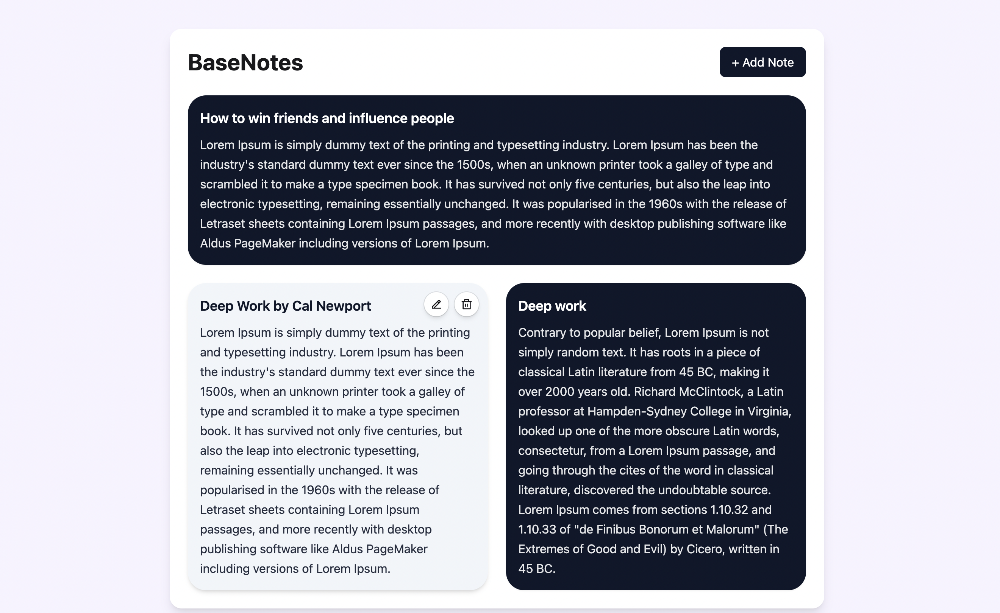

# BaseNotes 📝

BaseNotes is a clean, responsive Notes App built with React + Tailwind CSS.  
This project is an intentional upgrade from my earlier Todo App — adding deeper CRUD logic, improved UI hierarchy, and persistence.

## ✨ Features
- Create, edit, and delete notes (CRUD)
- Persist notes using `localStorage` (synced via `useEffect`)
- Responsive card-based layout with clear typography and spacing
- Per-note actions (edit/delete)
- Empty state when there are no notes

## 🚀 Upgrade From My Todo App (What I Practiced Here)
- Moving from simple list state → **structured note objects**
- **Immutability** and controlled updates during edit flows
- Reusing one form for **create vs edit**
- Persisting UI state with `useEffect` + `localStorage`
- Styling and layout improvements using Tailwind utility classes

## 🖼 Screenshots

> Create a folder named `screenshots` in the project root and add your images there.



## 🛠 Tech Stack
- React
- JavaScript
- Tailwind CSS
- Vite (if you used Vite)

## 📦 Getting Started

### 1) Clone the repo
```bash
git clone https://github.com/Zarah679/basenotes.git
cd basenotes
